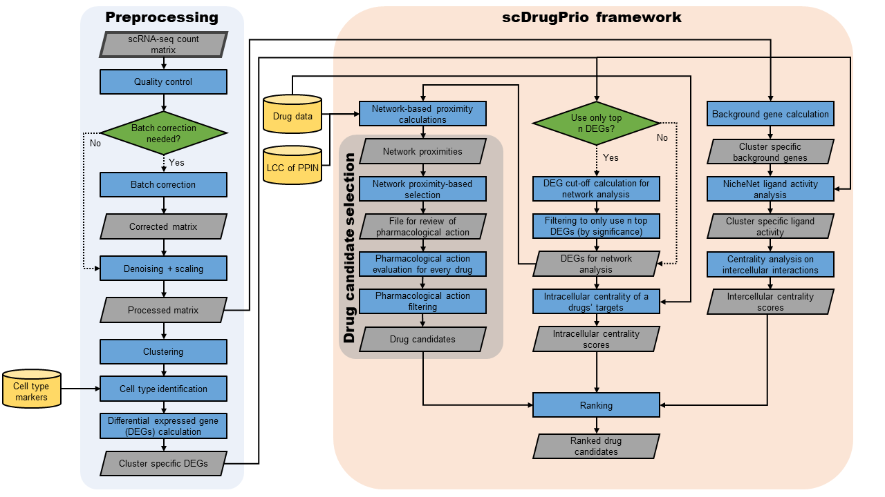
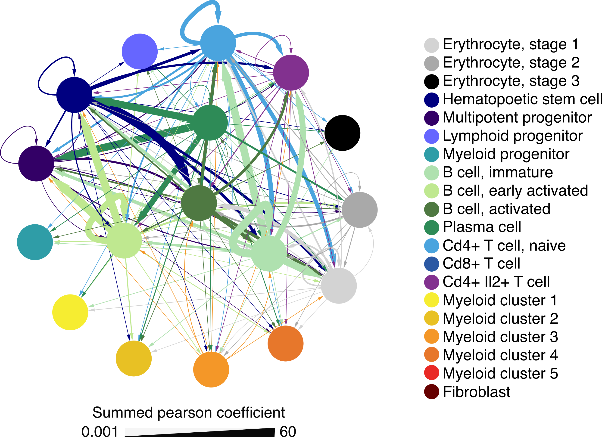

<!--  
#By SAMUEL SCHÄFER
#2022-01-21 
-->

# scDrugPrio: A framework for the analysis of single-cell transcriptomics to address multiple problems in precision medicine in immune-mediated inflammatory diseases

## General information

scDrugPrio presents a framework for drug prioritisation and repositioning in immune-mediated inflammatory diseases (IMIDs) based on scRNA-seq based, multicellular disease models (MCDMs) that incorporate key biological and pharmacological properties. Using scRNA-seq-derived differentially expressed genes (DEGs) of either 1) one individual or 2) a group comparison between patients and controls, scDrugPrio starts by identifying cell type-specific drug candidates by considering both proximity in a protein‒protein interaction network and biopharmacological criteria. To rank drug candidates, scDrugPrio calculates two measures, intracellular and extracellular centrality. We used these two measures to capture two important drug properties, namely, 1) proficiency in targeting key disease-associated expression changes in a cell type and 2) the relative importance of the targeted cell type. These measures are then aggregated over all cell types to provide a final drug ranking.
Because of the complexity and heterogeneity of IMIDs, we started by developing scDrugPrio using scRNA-seq data from a mouse model of antigen-induced arthritis. This reduced heterogeneity since the mice are inbred and the disease induced in a standardised way. Moreover, the mouse model allowed extensive *in vitro* and *in vivo* validation studies. Results were even validated in human *in vitro* experiments. Furthermore, we applied scDrugPrio to human Crohn’s disease, multiple sclerosis and psoriatic arthritis and achieve high prediction precision for known drug-disease pairs. Individual drug predictions on Crohn’s disease patients revealed that scDrugPrio was able to distinguish individual Crohn’s patients that did or did not respond to anti-TNF treatment. 

In the underlying [publication]("....") we exemplify the following case-of-use scenarios for scDrugPrio:
-	Drug repurposing predictions
-	Drug prioritisation for pooled patient data
-	Drug prioritisation for individual patient data
-	In a clinical trial setting in which two treatments are being compared, scDrugPrio might be used for retrospective prediction of which patients responded to treatments. Since scDrugPrio includes several relevant biological models of disease, this holds the potential to gain a better pathophysiological understanding of the patient at hand.

Additionally, it is imaginable that scDrugPrio might be used in a basket clinical trial with a finite set of possible treatments, for prospective assignment of patients to treatments, or for other drug related research questions.


## Overview 

<p align="center">
    
</p>

**Figure 2: Overview of the scDrugPrio workflow.** Single-cell RNA-sequencing (scRNA-seq) data from either individuals or groups of patients are preprocessed by undergoing quality control, denoising, clustering, cell typing and differentially expressed gene (DEG) calculation. DEGs for each cell type were calculated between healthy and sick samples. Using DEGs alongside information on drugs, scDrugPrio selects drug candidates (for each cell type; CT) whose gene targets are **1)** in network proximity to DEGs and **2)** who counteract disease-associated expression changes. These cell type-specific drug candidates are next ranked using intracellular and intercellular centrality. **3)** Intracellular centrality is computed based on the centrality of drug targets in the largest connected component (LCC) formed by DEGs and functions as a proxy for drug target importance. **4)** Intercellular centrality measures centrality in disease-associated cellular crosstalk networks called multicellular disease models (MCDMs). **5)** To derive a final ranking that aggregated cell type-specific drug selection and ranking into one list, drug candidates were ranked using a composite score of intra- and intercellular centralities.


## Input and output

To function, scDrugPrio will require:
1)	scRNA-seq data including both healthy and sick samples. For individual predictions, such scRNA-seq data might be comprised of inflamed and non-inflamed samples collected from one patient. For group-based prediction, such scRNA-seq data might include sick and healthy samples from several patients and controls. 
2)	Disease-associated differentially expressed genes (DEGs) that can be derived through comparison of gene expression between healthy and sick cells in 1).
3)	Drug target data that specifies protein targets for a drug.
4)	A protein-protein interaction network (PPIN).
5)	Depending on the users preprocessing steps, cell type markers or similar might be needed for cell typing. While cell typing is not a necessary step in the pipeline, it will enhance interpretability of the results.

We do not consider preprocessing steps below to be part of the scDrugPrio framework and the user might therefore devise this part as seen fit. However, preprocessing (especially calculation of DEGs) might affect later results.

<p align="center">
  
</p>

**Figure 2: scDrugPrio computational workflow, input and output data.** Initially, data are preprocessed following a standard approach, resulting in the calculation of cell type-specific differentially expressed genes (DEGs) between sick and healthy cells. The need for batch correction was evaluated through heterogeneity analyses as described in the methods and supplementary methods section. The DEG calculation utilized either paired samples (e.g., one healthy and one sick sample) from an individual or pooled samples from several healthy controls and patients. The scDrugPrio framework then performs drug selection using DEGs and drug data for network proximity calculation. The cell type-specific drug candidates are aggregated into a final drug ranking using intracellular and intercellular centrality. Gray parallelograms represent data files, yellow cylinders represent external data and green rombs indicate decision points.


## Drug selection
Drug selection is performed for each cell type individually and included network proximity and pharmacological action filtering. Firstly, mean closest network distance was calculated. Valid drug candidates tended to have a smaller than expected by chance mean network distance between their drug targets and disease-associated DEGs, additionally, they tended to target at least on disease-associated DEG directly. Pharmacological action filtering followed the simple assumption that drugs need to counteract disease-associated expression changes in order to treat immune-mediated inflammatory disease. To check this, we compared the fold change of directly targeted DEGs to the expected pharmacological action on that target and determined. See below:

|                                    | **Upregulated DEGs**         | **Downregulated DEGs**           |
|----------------------------------: |:----------------------------:| :-------------------------------:|
|**Agonistic drug effect**           | Mimicking disease            | Counteracting disease            |
|**Antagonistic drug effect**        | Counteracting disease        | Mimicking disease                |
|**Drug effect on target not clear** | N/A                          | N/A                              |


## Intercellular disease models (part of the MCDM)

After drug selection, scDrugPrio will apply [NicheNet](https://github.com/saeyslab/nichenetr)[^1] to select ligand interactions between cell types that were predictive of the transcriptomic perturbation observed in the downstream cell type. This allowed creation of a directed multicellular disease model which reflect altered cell type signalling in disease. We found that cell type centrality in the MCDM correlated well with the significance of GWAS enrichment among the DEGs of a cell type and the prediction precision for disease-relevant drugs. In other words, drug candidates that targeted central cell types in the MCDM were more likely to be effective.

<p align="center">
  
</p>

**Figure 3: Visualisation of a multicellular model for antigen induced arthritis.** In this network plot, each node represents a cell type and edges represent directed ligand interactions derived from NicheNet. For visual interpretation, edge width corresponds to the combined ligand effects on the downstream cell types gene expression (as measured by summed Pearson correlation coefficient). 


## Intracellular disease models (part of the MCDM)

Intracellular disease models refer to the modelling of a drug's effect on individual cell type's transcriptomic changes. We investigated such a relationship using three different approaches, namely:
1. Average closest network distance calculation between drug targets and DEGs. Systematic calculations based on the DEGs of each cell type allowed capture of relevant drug candidates while preserving a high degree of biological difference between cell types.
2. Eigenvector centrality of a drug's targets in the cell type specific disease module (defined as the largest connected component formed by a cell types DEGs in the PPIN). The intracellular centrality severed as a measure of pharmacological importance.
3. The pharmacological effect of a drug on the targeted DEGs. Arguably, a drug should aim to restore transcriptomic homeostasis to be considered an elligable candidate for treatment. On the other hand, a drug that upregulates it's target (e.g. TNF) when the target (TNF) is already upregulated in disease-state is likely not a good candidate as it could worsen disease.

## Drug candidate selection

Drug candidates were selected for each cell type individually based on network proximity and pharmacological action on the drug targets. Specifically, drugs were selected based on dc < 1 as well as zc < -1.64 (that is one-sided P < 0.05 derived by comparison of dc to a random distribution). Furthermore, drug candidates were required to counteract the fold change of at least one targeted DEG to ensure that they had potential to restore transcriptomic homeostasis. These selection parameters were validated, for details we refer the reader to our manuscript ***INSERT LINK TO PREPRINT / MANUSCRIPT***.

## Drug candidate ranking

While intracellular disease models, including the biopharmacological properties of the drugs and centrality of drug targets in the cell type specific disease models, were used to understand the pharmacological potential of a drug on a given cell type intercellular disease models were used to set each cell type into a context of relative importance for the collective disease. To rank drugs accordingly, we calculated the sum of all cell types eigenvector centrality in which a drug was considered to be a candidate. This combined intercellular eigenvector centrality served as a measure of the general importance of the targeted cell types in the MCDM. Next, we calculated the mean of a drug candidates intracellular eigenvector centrality over all cell types in which the drug was considered a candidate to derive a measure indicative of the average pharmacological potential of a drug on the targeted cell types. Final ranking was primarily based on the combined intercellular centrality score and secondly the mean of the intracellular eigenvector centrality. For more detail we refer the reader to the manuscript acompanying scDrugPrio ***LINK TO OUR PUBLICATION / PREPRINT***.

# Setup

## R environment of scDrugPrio

Analysis was conducted in R 3.6.3 if not otherwise stated. This package is compatible with R >= 3.6.

Dependencies: dplyr (>= 1.0.7), Seurat (>= 3.1.0), R.filesets (>= 2.12.1), igraph (>= 1.2.6), doParallel (>= 1.0.15), CINNA (>= 1.1.51), reshape2 (>= 1.4.4), ggplot2 (>= 3.3.5), nichenetr (>= 1.0.0), MAST (>= 1.19.0), limma (>= 3.54.0) and ComplexHeatmap (>= 2.14.0).

Suggested packages: RCurl, GEOquery, KEGGREST, KEGGgraph, devtools.

If problems occur during installation of dependencies please locate [SETUP.R](inst/SETUP.R), download it and ```source("scDrugPrio/inst/SETUP.R")``` to install the correct package versions.

## Installation of scDrugPrio

```{R}
install.packages("devtools")
devtools::install_github("SDTC-CPMed/scDrugPrio")
```

## Input data

scRNA-seq data for the antigen-induced arthritis mouse model of rheumatoid arthritis can be downloaded from [Gene Expression Omnibus](https://www.ncbi.nlm.nih.gov/geo/) (GEO) using accessionnumber GSE193536. Observe that the raw expression matrix is packaged as a .csv.gz file. If this leads to problems, we suggest decompressing by running ```find -name  'GSE193536_Joint_expression_matrix.csv.gz' -exec gzip -d {} \;``` in Linux command line.  Meta-data can be found on figshare [10.6084/m9.figshare.21785333](https://figshare.com/s/d75d0136702ba324c1d2).

scRNA-seq data for multiple sclerosis patients were retrieved from GEO (GSE138266)[^2]. Meta-data for the batch-corrected analysis can be found on figshare [10.6084/m9.figshare.21842193](https://figshare.com/s/eb05de865ae3e560eb55).

scRNA-seq data for Crohn's disease patients were retrieved from GEO (GSE134809)[^3]. Meta-data for the pooled, batch-corrected analysis can be found on figshare [10.6084/m9.figshare.21856728](https://figshare.com/s/27425b1fa697ecb81de7). Meta-data for the non-batch-corrected individual patient analyses can be found on [10.6084/m9.figshare.21856803](https://figshare.com/s/2c69f02a6ab089f0fe65).

scRNA-seq data for psoriatic arthritis can be retrieved from GEO (accession number pending). Meta-data for the batch-corrected anti-TNF data set can be found on [10.6084/m9.figshare.21856854](https://figshare.com/s/25e2acc2ca8e82249fd3) and the respective anti-IL17 dataset can be found on [10.6084/m9.figshare.21856866](https://figshare.com/s/a00e876ce91a8b066586).

Other imported data included the download of DrugBank[^4], GWAScatalog[^5], Online mendelian inheritence of man (OMIM)[^6], human-mouse homologs from NCBI and the HUGO Gene Nomenclature Committee (HGNC) annotation system[^7]. Furthermore, we included microarray data for rheumatoid arthritis from GSE55235[^8] and GSE93272[^9] as well as the HuRI PPIN[^10] for validation. Filtered versions of these data bases can be found in [data-raw](data-raw/) or the supplementary files of the publication.

## Example workflow

To learn how to apply scDrugPrio to create multicellular digital twins for pharmacological predictions please refer to the vigenette:
* [Workflow for scDrugPrio application to scRNA-seq data sets](vignettes/sample_workflow_scDrugPrio.md)

## Creation of 3D network visualization for interaction between activated B cell DEGs and drug candidates

In order to better understand the interactions between DEGs and potential drug candidates, selected based on zc < -1.64 and dc < 1, we created a [3D visualisation](https://scpred.shinyapps.io/3D_network/) for the most central cell type (activated B cells) in the antigen induced arthritis mouse data. Interactions between DEGs (blue) are representing protein-protein interactions (PPI) described in the literature-curated PPI network by do Valle et al.[^11]. DEGs node size is based on fold change. Potential drug candidates are connected to their respective gene drug targets by edges. Candidates are shown in red, established drugs for human rheumatoid arthritis are represented in yellow. The higher the absolute value of a drugs Y-axis value the higher the z-score. Drug candidates that counteracted at least one DEGs fold change received positive Y-axis values while drug candidates that did not counteract the fold change of any targeted DEG received negative Y-axis values. By clicking on one of the nodes, the neighbouring nodes are highlighted. This visualization allows the user to explore the importance of the  biopharmacological criteria. The 3D network was created in R version 4.1.1. The following R packages were used: igraph (1.2.6), plotly (4.10.0), shiny (1.6.0) and shinyjs (2.0.0).

# Replication
Deep Count Autoencoder (DCA)[^12] denoising was applied to each data set through calling the python application from the terminal. Raw expression data files can be found at the corresponding (GEO) repositories.

Analysis of data sets can be replicated based on files uploaded to figshare. Files have to be downloaded manually, as figshare does not allow automated downloads due to requiring authentication. Upon having downloaded meta-data from figshare, we kindly ask that the user positions files and R codes as described in the `README.txt` file in respective R code collection (`inst/AIA`, `inst/MS`, `inst/pooled_CD`, `inst/Individual_CD`, `inst/anti_TNF_PsA` or `inst/anti_IL17_PsA`). To each code such collection a `MAIN.R` file has been added that specifies the order in which scripts should be run. Of note is that the replication with the codes will result in long run times and require up to 300GB RAM and access to up to 50 cores. These settings can be altered by the user in the codes if required.

# References

[^1]: Browaeys, R., Saelens, W. & Saeys, Y. NicheNet: modeling intercellular communication by linking ligands to target genes. Nature Methods 17, 159-162, doi:10.1038/s41592-019-0667-5 (2020).
[^2]: Schafflick, D. et al. Integrated single cell analysis of blood and cerebrospinal fluid leukocytes in multiple sclerosis. Nat Commun 11, 247, doi:10.1038/s41467-019-14118-w (2020).
[^3]: Martin, J. C. et al. Single-Cell Analysis of Crohn's Disease Lesions Identifies a Pathogenic Cellular Module Associated with Resistance to Anti-TNF Therapy. Cell 178, 1493-1508.e1420, doi:10.1016/j.cell.2019.08.008 (2019).
[^4]: Wishart, D. S. et al. DrugBank: a comprehensive resource for in silico drug discovery and exploration. Nucleic Acids Res 34, D668-672, doi:10.1093/nar/gkj067 (2006).
[^5]: Buniello, A. et al. The NHGRI-EBI GWAS Catalog of published genome-wide association studies, targeted arrays and summary statistics 2019. Nucleic Acids Res 47, D1005-d1012, doi:10.1093/nar/gky1120 (2019).
[^6]: Amberger, J., Bocchini, C. A., Scott, A. F. & Hamosh, A. McKusick's Online Mendelian Inheritance in Man (OMIM). Nucleic Acids Res 37, D793-796, doi:10.1093/nar/gkn665 (2009).
[^7]: Tweedie, S. et al. Genenames.org: the HGNC and VGNC resources in 2021. Nucleic Acids Res 49, D939-d946, doi:10.1093/nar/gkaa980 (2021).
[^8]: Woetzel, D. et al. Identification of rheumatoid arthritis and osteoarthritis patients by transcriptome-based rule set generation. Arthritis Res Ther 16, R84, doi:10.1186/ar4526 (2014).
[^9]: Tasaki, S. et al. Multi-omics monitoring of drug response in rheumatoid arthritis in pursuit of molecular remission. Nature communications 9, 2755-2755, doi:10.1038/s41467-018-05044-4 (2018).
[^10]: Luck, K. et al. A reference map of the human binary protein interactome. Nature 580, 402-408, doi:10.1038/s41586-020-2188-x (2020).
[^11]: do Valle, I. F. et al. Network medicine framework shows that proximity of polyphenol targets and disease proteins predicts therapeutic effects of polyphenols. Nature Food 2, 143-155, doi:10.1038/s43016-021-00243-7 (2021).
[^12]: Eraslan, G., Simon, L. M., Mircea, M., Mueller, N. S. & Theis, F. J. Single-cell RNA-seq denoising using a deep count autoencoder. Nature Communications 10, 390, doi:10.1038/s41467-018-07931-2 (2019).
