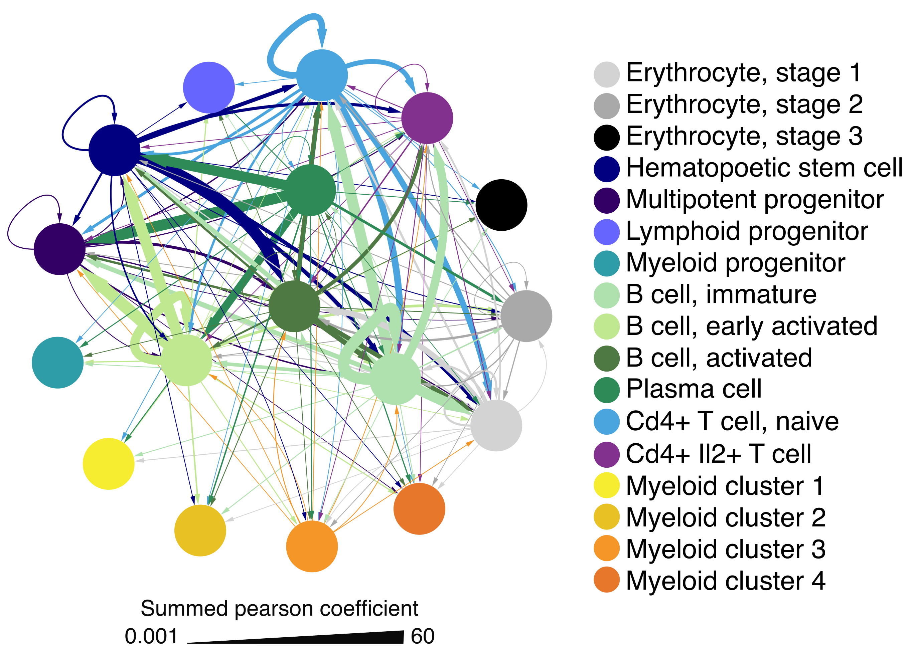

<!--  
#By SAMUEL SCHÄFER
#2022-01-21 
-->

# scDrugPrio: Network analyses of single cell-based digital twins for personalized treatment of inflammatory diseases
**S**wedish **D**igital **T**win **C**onsortium **-** **C**enter for **P**ersonalized **M**edicine

## scDrugPrio: General information

scDrugPrio presents a strategy for drug repositioning based on scRNA-seq based, multidimensional and multicellular disease models that incorporate the key biological and pharmacological properties. scDrugPrio was primarily developed using data from a mouse model (antigen induced arthritis, AIA) of rheumatoid arthritis (RA) and validated in *in vitro* experiments and by prediction precision for known drug-disease pairs in AIA and human scRNA-seq data sets (multiple sclerosis, MS, and Crohn's disease, CD). *In vitro* experiments aimed to validate five repurposing candidate drugs that had no prior evidence in AIA or rheumatoid arthritis. Two of five tested candidates, along with the positive controll showed significant *in vitro* effect. Out of these two drugs, one was chosen for *in vivo* experiments and validated succesfully. The relevance of predicted candidates was further validated by predictions consistently reaching high precision for disease-relevant drugs (defined as drugs that were approved for treatment of respective disease). When applied to human multiple sclerosis and Crohn’s disease, scDrugPrio was able to identify different treatment regimens for a anti-TNF responder and non-responder on individual variations. We hence propose scDrugPrio as a solution to personalise treatment by projecting network-based drug screening to digital twins of individual patients on cellulome-, genome-and drugome-wide scales.

## Overview <br><br>  <br><br>
**Schematic overview figure. 1)** Single-cell RNA-sequencing (scRNA-seq) data from a mouse model of antigen-induced arthritis (AIA) and healthy mice; **2)** were denoised, **3)** and cell typed; and **4)** differentially expressed genes (DEGs) between sick and healthy mice computed. scDrugPrio was applied to prioritise drugs whose gene targets were in network proximity to the most central DEGs in the most central cell types, as well as counteracted the directionality of the DEGs. For this, **5)** multicellular disease models (MCDMs) were constructed by connecting DEGs in each cell type with their predicted upstream regulators in all other cell types (CT1-CT7). This allowed **6)** computation of the network centrality as a measure of relative importance of cell types in the MCDM. Drug candidates were **7)** selected for each cell type based on the network proximity of their target genes to DEGs, as well as biopharmacological properties. **8)** In each cell type the drug target centrality was computed, based on the intracellular centrality of the targeted DEGs in the largest connected component (LCC) formed by DEGs. **9)** Next, drug candidates were ranked using a composite score of **6)** intercellular centralities and **8)** intracellular centralities. For example, in CT4, Drugs A’s and B’s target proteins are proximal to the disease associated DEGs, while Drug C’s target is not (**7**). Drug A and B also have relevant biopharmacological effects (counteracting the disease- associated gene expression), leading to their selection as drug candidates in CT4. In a similar manner drug candidates are selected in all cell types included in the MCDM. To establish **9)** a ranked list including all drug candidates from all cell types, a combined relevance score was calculated based on intracellular and intercellular centrality. Crossed out values in the table indicate that a drug was not selected as a candidate in this cell type during step **7)**. In the example above, Drug C is not selected as a candidate in any cell type and, therefore, removed completely from the final list. Drug B ranks higher than Drug A as it **8)** targets more central DEGs in the cell type specific LCC’s and **6)** more central cell types in the MCDM.

## Intercellular disease models / Multicellular disease models (MCDMs)

After scRNA-seq data had been denoised, clustered and differentially expressed genes (DEGs) had been calculated we applied [NicheNet](https://github.com/saeyslab/nichenetr)[^1] to select ligand-target interactions between cell types that were predictive of the transcriptomic perturbation observed in the downstream cell type. This allowed creation of a directed multicellular disease model which reflected the altered information flow in disease. Using centrality in the MCDM we were able to rank cell types by their relative importance, which correlated well with the significance of GWAS enrichment among the DEGs of a cell type and the prediction precision for disease-relevant drugs.
<br><br>  <br><br>

## Intracellular disease models

Intracellular disease models refer to the modelling of a drug's effect on individual cell type's transcriptomic changes. We investigated such a relationship using three different approaches, namely:
1. Average closest network distance calculation between drug targets and DEGs. Systematic calculations based on the DEGs of each cell type allowed capture of relevant drug candidates while preserving a high degree of biological difference between cell types.
2. Eigenvector centrality of a drug's targets in the cell type specific disease module (defined as the largest connected component formed by a cell types DEGs in the PPIN). The intracellular centrality severed as a measure of pharmacological importance.
3. The pharmacological effect of a drug on the targeted DEGs. Arguably, a drug should aim to restore transcriptomic homeostasis to be considered an elligable candidate for treatment. On the other hand, a drug that upregulates it's target (e.g. TNF) when the target (TNF) is already upregulated in disease-state is likely not a good candidate as it could worsen disease.

## Drug candidate selection

Drug candidates were selected for each cell type individually based on network proximity and pharmacological action on the drug targets. Specifically, drugs were selected based on dc < 1 as well as zc < -1.64 (that is one-sided P < 0.05 derived by comparison of dc to a random distribution). Furthermore, drug candidates were required to counteract the fold change of at least one targeted DEG to ensure that they had potential to restore transcriptomic homeostasis. These selection parameters were validated, for details we refer the reader to our publication ***INSERT LINK TO PREPRINT / MANUSCRIPT***.

## Drug candidate ranking

While intracellular disease models, including the biopharmacological properties of the drugs and centrality of drug targets in the cell type specific disease models, were used to understand the pharmacological potential of a drug on a given cell type intercellular disease models were used to set each cell type into a context of relative importance for the collective disease. To rank drugs accordingly, we calculated the sum of all cell types eigenvector centrality in which a drug was considered to be a candidate. This combined intercellular eigenvector centrality served as a measure of the general importance of the targeted cell types in the MCDM. Next, we calculated the mean of a drug candidates intracellular eigenvector centrality over all cell types in which the drug was considered a candidate to derive a measure indicative of the average pharmacological potential of a drug on the targeted cell types. Final ranking was primarily based on the combined intercellular centrality score and secondly the mean of the intracellular eigenvector centrality. For more detail we refer the reader to the publication acompanying scDrugPrio ***LINK TO OUR PUBLICATION / PREPRINT***.

# Setup

## R environment of scDrugPrio

Analysis was conducted in R 3.6.3 if not otherwise stated. Apart from DEG calculation using the MAST package which requires R >= 3.5, this package is compatible with R >= 3.4.

Dependencies: dplyr (>= 1.0.7), Seurat (>= 3.1.0), R.filesets (>= 2.12.1), igraph (>= 1.2.6), doParallel (>= 1.0.15), CINNA (>= 1.1.51), reshape2 (>= 1.4.4), ggplot2 (>= 3.3.5), nichenetr (>= 1.0.0), MAST (>= 1.19.0).

Suggested packages: RCurl, GEOquery, KEGGREST, KEGGgraph, devtools.

If problems occur during installation of dependencies please locate [SETUP.R](inst/SETUP.R), download it and ```source("scDrugPrio/inst/SETUP.R")``` to install the correct package versions.

## Installation of scDrugPrio

```{R}
install.packages("devtools")
devtools::install_github("SDTC-CPMed/scDrugPrio")
```

## Input data

scRNA-seq data for the antigen-induced arthritis mouse model of rheumatoid arthritis can be downloaded from [Gene Expression Omnibus](https://www.ncbi.nlm.nih.gov/geo/) (GEO) using accessionnumber GSE193536.

scRNA-seq data for multiple sclerosis patients were retrieved from GEO (GSE138266)[^2]

scRNA-seq data for Crohn's disease patients were retrieved from GEO (GSE134809)[^3]

scRNA-seq data for psoriatic arthritis can be retrieved from GEO (accession number pending).

Other imported data included the download of DrugBank[^4], GWAScatalog[^5], Online mendelian inheritence of man (OMIM)[^6], human-mouse homologs from NCBI and the HUGO Gene Nomenclature Committee (HGNC) annotation system[^7]. Furthermore, we included microarray data for rheumatoid arthritis from GSE55235[^8] and GSE93272[^9] as well as the HuRI PPIN[^10] for validation. Filtered versions of these data bases as well as meta-data for scRNA-seq files can be found in [data-raw](data-raw/) or on [figshare](https://figshare.com/s/d75d0136702ba324c1d2). For raw data sets we refer the reader to the original data sources.

## Example workflow

To learn how to apply scDrugPrio to create multicellular digital twins for pharmacological predictions please refer to the vigenette:
* [Workflow for scDrugPrio application to scRNA-seq data sets](vignettes/sample_workflow_scDrugPrio.md)

## Creation of 3D network visualization for interaction between activated B cell DEGs and drug candidates

In order to better understand the interactions between DEGs and drug candidates, selected based on zc < -1.64 and dc < 1, we created a 3D [visualisation](https://scpred.shinyapps.io/3D_network/) for the most central cell type (activated B cells) in the antigen induced arthritis mouse data. Interactions between DEGs (blue) are representing protein-protein interactions (PPI) described in the literature-curated PPI network by do Valle et al.[^11]. DEGs node size is based on fold change. Drug candidates are connected to their respective gene drug targets by edges. Potential drug candidates are shown in red. Established drugs for human rheumatoid arthritis are represented in yellow. The higher the absolute value of a drugs Y-axis value the higher the drug rank. Drug candidates that counteracted at least one DEGs fold change received positive Y-axis values while drug candidates that did not counteract the fold change of any targeted DEG received negative Y-axis values. By clicking on one of the nodes, the neighbouring nodes are highlighted. The visualization was created in R version 4.1.1. The following R packages were used: igraph (1.2.6), plotly (4.10.0), shiny (1.6.0) and shinyjs (2.0.0).

# Replication
Deep Count Autoencoder (DCA)[^12] denoising was applied to each data set through calling the python application from the terminal. Raw expression data files can be found at the corresponding (GEO) repositories.

Analysis of data sets can be replicated based on files provided in [data-raw](data-raw/) using the provided functions. Large data files such as DCA adjusted expression files were uploaded to [figshare](https://figshare.com/s/d75d0136702ba324c1d2). If not manually downloaded and inserted into the correct directory, the following functions will download the necessary data files automatically from [figshare](https://figshare.com/s/d75d0136702ba324c1d2) and store it in the correct sub-directories of [data-raw](data-raw/):
```
# AIA data
source("inst/replication_of_analysis_AIA_data.R")
replication_of_analysis_AIA_data()
# MS data
source("inst/replication_of_analysis_MS_data.R")
replication_of_analysis_MS_data()
# CD data
source("inst/replication_of_analysis_CD_data.R")
replication_of_analysis_CD_data()
# CD data for individual patients
source("inst/replication_of_analysis_INDIVIDUAL_CD_data.R")
replication_of_analysis_INDIVIDUAL_CD_data()
```

# References

[^1]: Browaeys, R., Saelens, W. & Saeys, Y. NicheNet: modeling intercellular communication by linking ligands to target genes. Nature Methods 17, 159-162, doi:10.1038/s41592-019-0667-5 (2020).
[^2]: Schafflick, D. et al. Integrated single cell analysis of blood and cerebrospinal fluid leukocytes in multiple sclerosis. Nat Commun 11, 247, doi:10.1038/s41467-019-14118-w (2020).
[^3]: Martin, J. C. et al. Single-Cell Analysis of Crohn's Disease Lesions Identifies a Pathogenic Cellular Module Associated with Resistance to Anti-TNF Therapy. Cell 178, 1493-1508.e1420, doi:10.1016/j.cell.2019.08.008 (2019).
[^4]: Wishart, D. S. et al. DrugBank: a comprehensive resource for in silico drug discovery and exploration. Nucleic Acids Res 34, D668-672, doi:10.1093/nar/gkj067 (2006).
[^5]: Buniello, A. et al. The NHGRI-EBI GWAS Catalog of published genome-wide association studies, targeted arrays and summary statistics 2019. Nucleic Acids Res 47, D1005-d1012, doi:10.1093/nar/gky1120 (2019).
[^6]: Amberger, J., Bocchini, C. A., Scott, A. F. & Hamosh, A. McKusick's Online Mendelian Inheritance in Man (OMIM). Nucleic Acids Res 37, D793-796, doi:10.1093/nar/gkn665 (2009).
[^7]: Tweedie, S. et al. Genenames.org: the HGNC and VGNC resources in 2021. Nucleic Acids Res 49, D939-d946, doi:10.1093/nar/gkaa980 (2021).
[^8]: Woetzel, D. et al. Identification of rheumatoid arthritis and osteoarthritis patients by transcriptome-based rule set generation. Arthritis Res Ther 16, R84, doi:10.1186/ar4526 (2014).
[^9]: Tasaki, S. et al. Multi-omics monitoring of drug response in rheumatoid arthritis in pursuit of molecular remission. Nature communications 9, 2755-2755, doi:10.1038/s41467-018-05044-4 (2018).
[^10]: Luck, K. et al. A reference map of the human binary protein interactome. Nature 580, 402-408, doi:10.1038/s41586-020-2188-x (2020).
[^11]: do Valle, I. F. et al. Network medicine framework shows that proximity of polyphenol targets and disease proteins predicts therapeutic effects of polyphenols. Nature Food 2, 143-155, doi:10.1038/s43016-021-00243-7 (2021).
[^12]: Eraslan, G., Simon, L. M., Mircea, M., Mueller, N. S. & Theis, F. J. Single-cell RNA-seq denoising using a deep count autoencoder. Nature Communications 10, 390, doi:10.1038/s41467-018-07931-2 (2019).
