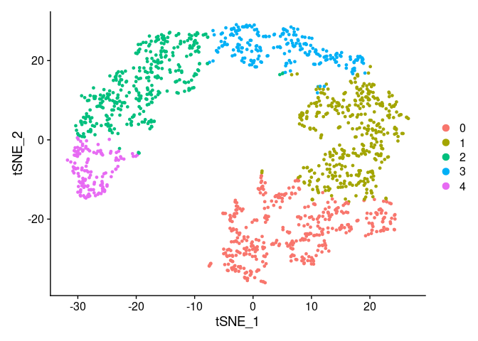

## Overview

scDrugPrio presents a strategy for drug repositioning based on scRNA-seq
based, multidimensional and multicellular disease models that
incorporate the key biological and pharmacological properties.
scDrugPrio was primarily developed using data from a mouse model
(antigen induced arthritis, AIA) of rheumatoid arthritis (RA) and
validated in *in vitro* experiments and by prediction precision for
known drug-disease pairs in AIA and two human scRNA-seq data sets
(multiple sclerosis, MS, and Crohn’s disease, CD).

In this vignette we will go through all steps required to format the
input data, create intercellular and intracellular disease models,
select drug candidates for each cell type and create a final ranking for
all the candidates.

Workflow of scDrugPrio:

1.  Setup
    -   Installation of scDrugPrio
2.  Data formatting
    -   Make drug target matrix
    -   Extract largest connected component (LCC) of protein-protein
        interaction network (PPIN)
    -   Select unique drug target combinations found in LCC of PPIN
3.  Deep count autoencoder (DCA) denoising of expression data
4.  Formatting of single cell RNA-sequencing data
    -   Seurat for clustering
    -   MAST framework for calculation of differentially expressed genes
    -   Cell typing using marker genes
5.  NicheNet ligand activity analysis
    -   Background gene calculation for NicheNet
    -   Centrality calculation in MCDM
6.  Intracellular disease models
    -   Network distance calculation
    -   Summary of network distance calculations
    -   Evaluation of drug candidates effect on targeted DEGs
    -   Drug target centrality in cell type specific disease modules
7.  Final drug candidate ranking

This vignette guides you in detail through all these steps. As example
data, we are using a subsample of the scRNA-seq data for the antigen
induced arthritis (AIA) model.

Here, we describe the workflow using methods that were deployed by us
during the original analyses used for the development and validation of
scDrugPrio. Please note though that scDrugPrio, strictly speaking, could
be applied to any sort list with differential expressed genes. This
means that step 3 & 4 in the workflow could be replaced by other methods
if the user so chooses.

## Setup and data formatting

### Installation of scDrugPrio

``` r
# From GitHub:
install.packages("devtools")
devtools::install_github("SDTC-CPMed/scDrugPrio")

# or local installation:
install.packages("scDrugPrio_1.0.0.tar.gz", repos = NULL, type = "source")
library(scDrugPrio)
```

In case scDrugPrio does not install correctly, common installation
issues might be connected to the package versions of limma,
ComplexHeatmap, MAST or nichenetr. We recommend trying the following:

``` r
if (!require("BiocManager", quietly = TRUE))
    install.packages("BiocManager")
BiocManager::install("limma")
BiocManager::install("ComplexHeatmap")
BiocManager::install("MAST")
if (!require("devtools", quietly = TRUE))
    install.packages("devtools")
devtools::install_github("saeyslab/nichenetr")
```

## Data formatting

scDrugPrio comes equipped with some sample data that was prepared to
increase the excecutability of the code below on your personal machine.
This sample data does not correspond to the data used originally in the
publication. Data files used for the publication can be downloaded from
figshare (please see the “Input” section on the [scDrugPrio GitHub
page](https://github.com/SDTC-CPMed/scDrugPrio).

Lets, load the sample data:

``` r
load_sample_data()
```

As some of the functions will automatically save their output we will
need to create a output directory.

``` r
dir.create("Sample_output")
setwd("Sample_output")
```

### Make drug target matrix

One of the first tasks is to filter the DrugBank data. As an example, we
have selected the information for 146 drugs included in the DrugBank
data, please see the variable ‘drug_bank_example_data’.

``` r
head(drug_bank_example_data)
#>      drugID    drug_name   status     Swiss_target_ID
#> [1,] "DB00001" "Lepirudin" "approved" "P00734"       
#> [2,] "DB00002" "Cetuximab" "approved" "P00533"       
#> [3,] "DB00002" "Cetuximab" "approved" "O75015"       
#> [4,] "DB00002" "Cetuximab" "approved" "P00736"       
#> [5,] "DB00002" "Cetuximab" "approved" "P02745"       
#> [6,] "DB00002" "Cetuximab" "approved" "P02746" 
#>
#>      target_name                                                  gene_symbol
#> [1,] "Prothrombin"                                                "F2"       
#> [2,] "Epidermal growth factor receptor"                           "EGFR"     
#> [3,] "Low affinity immunoglobulin gamma Fc region receptor III-B" "FCGR3B"   
#> [4,] "Complement C1r subcomponent"                                "C1R"      
#> [5,] "Complement C1q subcomponent subunit A"                      "C1QA"     
#> [6,] "Complement C1q subcomponent subunit B"                      "C1QB"  
#>
#>      target_organism drug_action
#> [1,] "inhibitor"     "Humans"   
#> [2,] "antagonist"    "Humans"   
#> [3,] NA              "Humans"   
#> [4,] NA              "Humans"   
#> [5,] NA              "Humans"   
#> [6,] NA              "Humans"
```

This data has to be filtered for our predictions. Specifically, we
wanted to restrict predictions to drugs that are indicated for use on
"Humans", are (or have been) FDA approved and have at least one known
human drug target.

``` r
# Include only drugs for 'Humans'
drug_bank_example_data <- drug_bank_example_data[grepl(pattern = "Humans", x = drug_bank_example_data[,8]),]
# Include only 'approved' drugs
drug_bank_example_data <- drug_bank_example_data[grepl(pattern = "approved", x = drug_bank_example_data[,3]),]
# Include only drugs with at least one known drug target
drug_bank_example_data <- drug_bank_example_data[!is.na(drug_bank_example_data[,6]),]

# number of unique drugs after filtering
length(unique(drug_bank_example_data[,1]))
#> [1] 100
```

Later we will also have to integrate drug data with scRNA-seq data and
the human protein-protein interaction network (PPIN) which fosters the
need for a common gene annotation system. Here we choose the Entrez gene
ID system, as this was original gene annotation system for the human
PPIN. For translating human genes to mouse genes and Entrez gene symbols
to Entrez gene IDs we data from NCBI, represented by ‘transl’.

``` r
head(translation_mouse_human)
#>      human_gene_symbol human_entrez_ID mouse_gene_symbol mouse_entrez_ID
#> [1,] "ACADM"           "34"            "Acadm"           "11364"        
#> [2,] "ACADVL"          "37"            "Acadvl"          "11370"        
#> [3,] "ACAT1"           "38"            "Acat1"           "110446"       
#> [4,] "ACVR1"           "90"            "Acvr1"           "11477"        
#> [5,] "ADSL"            "158"           "Adsl"            "11564"        
#> [6,] "AGA"             "175"           "Aga"             "11593"

# translate drug target symbols to entrez gene IDs 
drug_bank_example_data[,6] <- translation_mouse_human[match(drug_bank_example_data[,6], translation_mouse_human[,1]),2]
drug_bank_example_data <- drug_bank_example_data[!is.na(drug_bank_example_data[,6]),]
```
Now that we have translated drug gene targets to Entrez IDs, we will 
summarize drug targets for all drugs in a matrix. Every column includes the
drug targets of one drug.

``` r
drug_target_matrix <- create_drug_target_matrix(drugID = drug_bank_example_data[,1], target = as.numeric(drug_bank_example_data[,6]))
#> Loading required package: foreach
#> Loading required package: iterators
#> Loading required package: parallel

drug_target_matrix[1:5,1:6]
#>      DB00001 DB00002 DB00004 DB00005 DB00006 DB00008
#> [1,]    2147    1956    3559    7124    2147    3455
#> [2,]      NA     715    3560    7133      NA    3454
#> [3,]      NA     712    3561    2209      NA      NA
#> [4,]      NA     713      NA    2214      NA      NA
#> [5,]      NA     714      NA    2212      NA      NA
```

### Selection of the largest connected component (LCC) of the protein-protein interaction network (PPIN)

Exclusion of nodes that are not connected to the largest connected
component (LCC) of the protein-protein interaction network (PPIN) is
crucial for network distance calculations so that path lengths have
finite values. In order to use only the LCC of the chosen PPIN in
further calculations we apply the following function:

``` r
# Full PPIN (literature curated) - genes annotated as Entrez Gene IDs
head(lit_ppi)
#>      Protein_A Protein_B
#> [1,]         1       310
#> [2,]         1       368
#> [3,]         1      1026
#> [4,]         1      2232
#> [5,]         1      2886
#> [6,]         1      3172
dim(lit_ppi)
#> [1] 351444      2

# n unique proteins in PPIN
length(unique(as.vector(lit_ppi)))
#> [1] 17706

# Select LCC
ppin <- ppin_formatting(lit_ppi)
#> [1] "n of unique proteins/genes in PPIN: n =  17651"
dim(ppin)
#> [1] 346324      2

# n unique proteins in LCC of PPIN
length(unique(as.vector(ppin)))
#> [1] 17651
```

As can be seen above the LCC of the literature curated PPIN includes
17651 unique proteins, compared to the 17706 proteins in the full
literature PPIN. Based on the difference in dimension we can also tell
that exclusion of the 55 proteins that were not connected to the LCC
reduced the number of protein-protein interaction by 351444 - 346324 =
5120.

### Select unique drug target combinations found in LCC of PPIN

``` r
# number of drug targets in drug_target_matrix
sum(!is.na(drug_target_matrix))
#> [1] 461

# number of drug targets in the drug_target_matrix that were found in PPIN
sum(drug_target_matrix[!is.na(drug_target_matrix)] %in% unique(as.vector(ppin)))
#> [1] 457

# are there drugs with no drug targets in PPIN?
sum(colSums(!is.na(drug_target_matrix)) == 0)
#> [1] 0

# are there drugs with identical drug targets?
sum(duplicated(t(drug_target_matrix)))
#> [1] 16
```

As seen above, the raw version of `drug_target_matrix` is not in optimal
shape for network distance calculation yet. It still includes drug
targets that are not found in the PPIN as well as 569 duplicated drug
target entries. To speed up computations and decrease file size we will
apply the
function `prepare_drug_target_matrix_for_network_distance_calculation()`
that will exclude all drug targets not found in the PPIN as well as
excludes duplicated sets of drug targets. Only unique drug target
combinations will remain. As we after network distance calculations plan
to map results for unique drug target combinations back to individual
drugs, `prepare_drug_target_matrix_for_network_distance_calculation()`
prepares a file titled
`paste("SAME_DRUG_TARGETS_", file_name, ".txt", sep="")` that notes
which drugs had identical targets in a given PPIN. This is especially
important given that two drugs might have the same drug targets and
hence the same network distances in the PPIN, but yet different
pharmacological actions on their target.

``` r
#Preparation of drug target matrix for network distance calculation.
drug_target_matrix <- prepare_drug_target_matrix_for_network_distance_calculation(ppin, drug_target_matrix, file_name = "in_lit_ppin", out_dir = "Sample_output")
#> [1] "n of unique proteins/genes in PPIN: n =  17651"
#> [1] "n unique drugs included in analysis: n = 88"
#> [1] "n drugs with unique drug target combinations: n = 70"
#> [1] "n unique drugs that can be extracted from UNIQUE_DRUG_TARGET_COMBINATION_in_lit_ppin.txt using SAME_DRUG_TARGETS_in_lit_ppin.txt: n = 88"
#> [1] "Drug matrix = FORMATTED"

# File noting which drugs had identical drug tragets in the PPIN
# Left column represents the DrugBank ID of a drug that will represent a unique set of drug targets in the network distance calculation
# Right column represents the DrugBank IDs of all individual drugs that have this drug target combination 
same_drugs <- read.table(file = "Sample_output/SAME_DRUG_TARGETS_in_lit_ppin.txt", sep="\t", header = T, stringsAsFactors = F)
head(same_drugs)
#>     Drug1   Drug2
#> 1 DB00001 DB00001
#> 2 DB00001 DB00006
#> 3 DB00002 DB00002
#> 4 DB00004 DB00004
#> 5 DB00004 DB00041
#> 6 DB00005 DB00005
```

## Deep count autoencoder denoising of expression data

Having prepared drug data and protein interaction networks for analysis,
we need to format the scRNA-seq data set for calculation. Initially,
quality criteria is applied to the raw single cell data aiming to
exclude cells of poor quality and genes that are only expressed in very
few cells. After this, we applied Deep Count Autoencoder (DCA)
denoising, as described by [Gökcen et
al.](https://www.nature.com/articles/s41467-018-07931-2), following the
recommendations at [theislab/dca](https://github.com/theislab/dca).
Briefly that meant:

    # Installation
    $ conda install -c bioconda dca

    # Application to single cell matrix (represented by matrix.csv)
    $ dca matrix.csv results

DCA creates several output files documenting the denoising process,
namely: dispersion.tsv, dropout.tsv, latent.tsv and mean.tsv

mean.tsv corresponds to the DCA denoised gene expression matrix. DCA
also outputs a representation of the original single-cell data in the
latent space (latent.tsv). This representation has fewer features than
the original data and represents cells expression differences generally
better than purely linear PCA models. The latent space representation is
also corrected for single-cell data artefacts such as dropouts and
varying library sizes. For the original data set swe provide the
necessary DCA derived files on figshare (please see “Input” section on
the [scDrugPrio GitHub page](https://github.com/SDTC-CPMed/scDrugPrio)).
For this example, we have loaded the DCA denoised expression matrix
(`denoised_DCA`) and the latent features (`latent_DCA`) into the R
environment already.

## Formatting of single cell RNA-sequencing data

### Seurat for clustering

Using Seurat 3.1.0, we cluster the data based on DCA-derived latent
features for optimal cell typing. A detailed vignette on clustering
using Seurat can be found on the original authors [GitHub page](https://github.com/satijalab/seurat).
In the code below the variable `denoised_DCA` represent the DCA derived `mean.tsv`
data and `latent_DCA` represent the DCA derived `latent.tsv` file. Both
`denoised_DCA` and `latent_DCA` are sample data that were created by
randomly subsampling the originally used data. In the single cell
RNA-sequencing based gene expression matrix (`denoised_DCA`) each row
represents a gene and each column an individual cell. Observe that some
Seurat functions might have been altered slightly if using Seurat v4.
One such function is `FindNeighbors()` where the default method for
k-nearest neighbor identification has been changed to `annoy` for
computational efficiency, our results however were produced using
`nn.method="rann` which was the default in Seurat v3.

``` r
library(Seurat)
#> Attaching SeuratObject
set.seed(12)

# Create Seurat object using denoised expression values
denoised_DCA_clustered <- CreateSeuratObject(counts = denoised_DCA, project = "DCA_denoised_clustered", min.cells = 1, min.features = 1)

# Dimensional reduction using DCA derived latent features instead of linear principal components
latent_DCA <- latent_DCA[,match(colnames(denoised_DCA), colnames(latent_DCA))]
pca <- new("DimReduc", cell.embeddings = t(latent_DCA), assay.used = "RNA", key = "PC_")

denoised_DCA_clustered@reductions$pca <- pca

# Clustering
denoised_DCA_clustered <- FindNeighbors(object = denoised_DCA_clustered, 
                                        reduction = "pca", 
                                        dims = 1:nrow(latent_DCA),
                                        k.param =  25,
                                        nn.method="rann") # shared nearest neighbor graph + Jaccard index
#> Computing nearest neighbor graph
#> Computing SNN

denoised_DCA_clustered <- FindClusters(denoised_DCA_clustered, resolution = 0.25) # Louvain algorithm
#> Modularity Optimizer version 1.3.0 by Ludo Waltman and Nees Jan van Eck
#> 
#> Number of nodes: 1500
#> Number of edges: 48953
#> 
#> Running Louvain algorithm...
#> Maximum modularity in 10 random starts: 0.9008
#> Number of communities: 5
#> Elapsed time: 0 seconds

# plot clusters
denoised_DCA_clustered <- RunTSNE(denoised_DCA_clustered, dims = 1:32)
TSNEPlot(denoised_DCA_clustered)
```
<p align="center">
  
</p>

Above code results in clustering of the scRNA-seq data. In
`CreateSeuratObject()` we can set `min.cells = 1` and `min.features = 1`, as
we in this example data set include scRNA-seq data that had already undergone application of
quality criteria. Application of the `FindNeighbors()`and
`FindClusters()`function with standard parameters will result in Seurat
constructing a shared nearest-neighbour graph followed by application of
the Louvain algorithm to the shared nearest neighbour graph to identify
clusters. In `FindNeighbors()`, specifying `k = 15`leads to Seurat using
the 15 nearest neighbours as defined by Jaccard index. In
`FindClusters()` the resolution parameter will affect the number of
identified clusters. The value of the resolution parameter will depend
on the size of the data set (number of cells). Arbitrary optimization of
`k` and `resolution` will be required for new data sets in order to
identify biologically valuable clusters, though there have been recent
suggestions by e.g. [Chen et al.] (https://doi.org/10.1093/gigascience/giz121)
that more systematicly aim to optimize PCs and resolution paramaters.

Having now clustered the data we will need to save cluster outcomes.

``` r
# Save the clustering outcome
id <- Idents(denoised_DCA_clustered)
id <- cbind(as.character(names(id)), as.character(id))
colnames(id) <- c("Cell_ID", "Cluster_ID")
write.table(id, file = "Cell_identity.txt", sep="\t", col.names = T, row.names = F)

# n cells per cluster
table(id[,2])
#> 
#>   0   1   2   3   4 
#> 409 384 350 221 136
```

### Cell typing using marker genes

For biological interpretation one might want to explore which cell type
corresponds to which cluster. This information is not essential for the
performance of the scDrugPrio package though and can be seen as a
add-on. While cell typing can be a time consuming and rigorous process,
for the purpose of this example workflow we keep it short and limit
ourself to a few known marker genes.

``` r
library(doParallel)
library(matrixStats)
library(reshape2)
library(ggplot2)
library(viridis)
#> Loading required package: viridisLite

# extract count-adjusted expression values of markerX <-  genes
X <- denoised_DCA_clustered@assays$RNA@counts
X <- X[rownames(X)%in% marker_genes,]
X <- as.matrix(X)

denoised_DCA_clustered@active.ident <- as.factor(floor(as.numeric(as.character(denoised_DCA_clustered@active.ident))))
unique_cl <- unique(as.numeric(as.character(denoised_DCA_clustered@active.ident)))

# calculate mean expression per cluster
out <- foreach(cl = c(1:length(unique_cl)), .combine = "rbind") %do% {
  exp <- X[, colnames(X)%in%id[id[,2]==unique_cl[cl],1]]
  exp <- exp[match(marker_genes, rownames(exp)),]
  return(rowMeans(exp))
}
colnames(out) <- marker_genes
rownames(out) <- unique_cl
out <- out[,colSums(!is.na(out))>0]

# Z - score
mode(out) <- "numeric"
temp <-colSds(out)
out <- t(t(out) - colMeans(out)) # center around 0
out <- t(t(out)/temp) # make z-scores

# Make heatmap
cl_order <- c(3,2,4,0,1)
out <- melt(out)
out$Var1 <- as.character(out$Var1)
out$Var1 <- factor(x = paste("Cluster_",as.character(out$Var1),sep=""), levels = paste("Cluster_",unique_cl[match(cl_order, unique_cl)],sep=""), ordered = T)

thresh <- 1.5

my_breaks <- seq(from = -thresh, to = thresh, by = 0.5)
my_labels <- seq(from = -thresh, to = thresh, by = 0.5)

out[out[,3] < -thresh,3] <- -thresh
out[out[,3] > thresh,3] <- thresh

heatmap <- ggplot(out, aes(x=Var2, y=Var1, fill=value)) +
  geom_raster(na.rm = T) + scale_fill_gradientn(colours = viridis(12), name = "count", breaks = my_breaks, labels = my_labels, limits = c(-thresh,thresh)) +
  theme(axis.text.x=element_text(angle=90, hjust=1))#, axis.text.y=as.character(), axis.ticks.y=element_blank())

plot(heatmap)
```

<br><br>  <br><br>

Based on the above heatmap, Cluster 1 and 0 seem to be B cells. Cluster
4 seems to be T cells. Cluster 2 expresses myeloid markers and Cluster 3
expresses several myeloid markers in semi-high quantities, so let’s for
the purpose of this example assume it is a form of myeloid cell. Of
course, the exact nature of the clusters would need to be explored more
carfefully, using additional marker genes or different cell typing
approaches if this were not an example.

### MAST framework for calculation of differentially expressed genes

DEG calculation was performed using the MAST framework which was called
on through Seurat. The MAST framework deploys a scRNA-seq tailored
hurdle model for evaluation of expression changes between groups. Here
we chose to calculate DEGs between cells from sick and healthy samples
within the same cluster. Before we start DEG calculations we will need
to define groups of cells between we wish to calculate DEGs. While we
believe the DEG calculation between sick and healthy cells within the
same cluster to be crucial for scDrugPrio, there are many ways in which
a user can make Seurat understand which group of cells it should use.
Our approach below is merely a suggestion.

``` r
id[grepl("Sick", id[,1]),2] <- as.numeric(id[grepl("Sick", id[,1]),2]) + 0.1
table(id[,2])
#> 
#>   0 0.1   1 1.1   2 2.1   3 3.1   4 4.1 
#> 185 224 237 147 173 177  87 134  68  68
# --> we have > 3 healthy and sick cells in each cluster enabling DEG calculation for all clusters

# Set new identities in Seurat object
temp_id <- as.factor(as.numeric(id[,2]))
denoised_DCA_clustered@active.ident <- temp_id

# unique clusters
temp_id_unique <- sort(as.numeric(unique(id[,2])))
```

Now that we have defined groups for DEG calculation we calculate DEGs
between healthy and sick cells in each cluster individually.

``` r
# Running MAST DEG calculation on DCA denoised data
calculate_DEGs <- function(temp_id_unique, outdir, seurat_obj, pseudo.count = 0, logfc = log(1.5)){
  # Running MAST DEGs analysis
  for(i in 1:(length(temp_id_unique)/2)){
    pos <- i*2-1
    
    temp <- id[id[,2] %in% temp_id_unique[pos],]
    id1 <- as.numeric(temp[,2])
    names(id1) <- temp[,1]
    id1 <- as.factor(id1)
    
    temp <- id[id[,2] %in% temp_id_unique[pos+1],]
    id2 <- as.numeric(temp[,2])
    names(id2) <- temp[,1]
    
    temp <- FindMarkers(seurat_obj,
                        slot = "counts", # DCA denoised, log10 transformed counts
                        test.use = "MAST",
                        ident.1 = names(id1), # important that this is a factor vector with cell labels as names
                        ident.2 = names(id2),
                        only.pos = F,
                        random.seed = 3,
                        pseudocount.use = pseudo.count, # not needed as DCA is already log10 transformed 
                        logfc.threshold = logfc,
                        min.pct = 0.1,
                        min.cells.group = 3)
      if(exists("temp")){
        write.table(temp, file = paste(outdir, "/Cluster_", temp_id_unique[pos], ".txt",sep=""),sep="\t",col.names=NA,row.names=T)
        rm(temp)
      }
  }
}
calculate_DEGs(temp_id_unique, outdir = "Sample_output", seurat_obj = denoised_DCA_clustered)

# Example output (plasma B cell DEGs):
head(read.table(file = "Sample_output/Cluster_1.txt", sep="\t", header = T, stringsAsFactors = F))
#>        X        p_val avg_log2FC pct.1 pct.2    p_val_adj
#> 1   Irf7 5.363586e-13 -0.7833968     1     1 1.303137e-08
#> 2 Ifitm3 4.901806e-12 -0.8896550     1     1 1.190943e-07
#> 3 Lgals3 2.173980e-11 -0.7913253     1     1 5.281901e-07
#> 4   Klf2 6.459201e-11 -0.6838869     1     1 1.569328e-06
#> 5 Fcer1g 8.610914e-11 -0.7105255     1     1 2.092108e-06
#> 6   Spp1 1.531374e-10 -0.6651808     1     1 3.720626e-06
```
Next we will make a summary of all clusters DEGs for easy access by
future functions.

``` r
# DEG summary for all clusters
outdir = "Sample_output"
files <- list.files(path = outdir, pattern = "Cluster_")

degs.clusters.h.vs.s <- matrix(NA, nrow = denoised_DCA_clustered@assays$RNA@counts@Dim[1], ncol = length(files))

for(i in 1:ncol(degs.clusters.h.vs.s)){
  temp <- read.table(file = paste(outdir, "/", files[i], sep=""), sep="\t", header = T)
  temp <- temp[temp$p_val_adj < 0.05,]
  temp <- as.character(temp[order(as.numeric(temp$p_val_adj), decreasing = F),1]) # order by significance
  if(length(temp)>0){
    degs.clusters.h.vs.s[1:length(temp),i] <- temp
  }
  rm(temp)
}
colnames(degs.clusters.h.vs.s) <- unlist(strsplit(files, split = ".txt"))

# remove empty rows
degs.clusters.h.vs.s <- degs.clusters.h.vs.s[rowSums(!is.na(degs.clusters.h.vs.s))>0,]
head(degs.clusters.h.vs.s)
#>      Cluster_0  Cluster_1 Cluster_2 Cluster_3 Cluster_4
#> [1,] "AF357399" "Irf7"    "Gm24245" NA        NA       
#> [2,] "Irf7"     "Ifitm3"  NA        NA        NA       
#> [3,] "Rtp4"     "Lgals3"  NA        NA        NA       
#> [4,] "Isg15"    "Klf2"    NA        NA        NA       
#> [5,] "mt-Nd2"   "Fcer1g"  NA        NA        NA       
#> [6,] "Mir6236"  "Spp1"    NA        NA        NA

write.table(degs.clusters.h.vs.s, file = paste(outdir, "/SUMMARY_sig_adj_MAST_DEGs_log(1.5)_all_clusters.txt", sep=""),sep="\t", col.names = T, row.names = F)
```

Here we can see that only Cluster 0 and Cluster 1 (the suspected B cell
clusters) express several DEGs. Cluster 2 (suspected myeloid cell)
expresses one DEG at a fold change cut-off of log(1.5). The remaining
clusters harbour no DEGs at the choosen cut-off.

## NicheNet ligand activity analysis

To generate the predicted cell type interactions we apply NicheNet
ligand activity analysis. In order for NicheNet ligand activity analysis
to suggest a directed ligand interaction between two cell types NicheNet
considers the expression of ligands in the sender cell type as well as
the evidence of ligand-related activation in the receiver cell type as
evidenced by the changed expression in proteins downstream of the
receptor. For analysis, NicheNet even requires information on the
background genes (all expressed genes) in the receiving cell type.

In the by us performed analysis we define these gene sets in the
following way: - potential ligands in the sender cell type = DEGs of the
sender cell type that are also ligands (as defined by NicheNet) - gene
set of interest in the receiving cell type = all DEGs of the receiving
cell type - background genes in the receiving cell type = all genes that
in the receiving cell type have a aggregated expression (Ea(i) \>= 0.2)
where Ea(i) = log2(mean(10^D\[i,\])). Here D represents the log10
normalized, denoised expression matrix for the cells of this cell type
and i represents an individual gene.

Based on the inferred cell type ligand interactions we can create a cell
type - cell type interaction network (intercellular network) and use it
to calculate the centrality of any cell type.

``` r
# format cell IDs to fit in function
cell_IDs <- denoised_DCA_clustered$seurat_clusters
cell_IDs <- foreach(i = c(1:length(unique_cl))) %do% {
  temp <- cell_IDs[as.character(cell_IDs) == unique_cl[i]]
  return(names(temp))
}
names(cell_IDs) <- paste("Cluster_", unique_cl, sep="")

# background gene calculation
bg <- background_genes_NicheNet(data = as.matrix(denoised_DCA_clustered@assays$RNA@counts), cell_IDs = cell_IDs)
#> [1] "n genes expressed 9541"
#> [1] "n genes expressed 6771"
#> [1] "n genes expressed 7363"
#> [1] "n genes expressed 8678"
#> [1] "n genes expressed 6896"

# make sure DEGs and background genes are annotated in human entrez symbols
degs_transl <- degs.clusters.h.vs.s

for(i in 1:ncol(degs_transl)){
  temp <- translation_mouse_human[match(x = degs_transl[,i], table =  translation_mouse_human[,3]),1]
  temp <- temp[!is.na(temp)]
  degs_transl[,i] <- NA
  if(length(temp)>0){
      degs_transl[1:length(temp),i] <- temp
  }
}
head(degs_transl)
#>      Cluster_0 Cluster_1 Cluster_2 Cluster_3 Cluster_4
#> [1,] "IRF7"    "IRF7"    NA        NA        NA       
#> [2,] "RTP4"    "IFITM3"  NA        NA        NA       
#> [3,] "ISG15"   "LGALS3"  NA        NA        NA       
#> [4,] "ND2"     "KLF2"    NA        NA        NA       
#> [5,] "ND5"     "FCER1G"  NA        NA        NA       
#> [6,] "OASL"    "SPP1"    NA        NA        NA
degs_transl <- degs_transl[rowSums(!is.na(degs_transl))>0, colSums(!is.na(degs_transl))>0]

for(i in 1:ncol(bg)){
  temp <- translation_mouse_human[match(x = bg[,i], table =  translation_mouse_human[,3]),1]
  temp <- temp[!is.na(temp)]
  bg[,i] <- NA
  if(length(temp)>0){
      bg[1:length(temp),i] <- temp
  }
}
bg <- bg[rowSums(!is.na(bg))>0,]
head(bg)
#>      Cluster_4  Cluster_2  Cluster_3  Cluster_0  Cluster_1 
#> [1,] "KIAA1841" "KIAA1841" "KIAA1841" "KIAA1841" "KIAA1841"
#> [2,] "C2orf68"  "C2orf68"  "C2orf68"  "C2orf68"  "C2orf68" 
#> [3,] "C11orf58" "C11orf58" "C11orf58" "C11orf58" "C11orf58"
#> [4,] "C9orf16"  "C9orf16"  "C9orf16"  "C9orf16"  "C9orf16" 
#> [5,] "C11orf1"  "KIAA1143" "C9orf85"  "C11orf1"  "C11orf1" 
#> [6,] "C8orf33"  "C6orf120" "KIAA1143" "C9orf85"  "KIAA1143"

# NicheNet ligand activity
dir.create(path = "Sample_output/NicheNet", showWarnings = F)
all_ligand_activity <- NicheNet_ligand_activity_analysis(degs = degs_transl, background_genes = bg, out_dir = "Sample_output/NicheNet", cores = 2)
print(head(all_ligand_activity))
#>      test_ligand auroc       aupr        aupr_corrected pearson       
#> [1,] "HAS2"      "0.5625099" "0.3011178" "0.083199495"  " 0.141367194"
#> [2,] "IL1B"      "0.5698709" "0.2950974" "0.077179042"  " 0.125654254"
#> [3,] "IL27"      "0.5706460" "0.2909062" "0.072987860"  " 0.120213038"
#> [4,] "CCL3L3"    "0.5527126" "0.2871428" "0.069224445"  " 0.111009836"
#> [5,] "EBI3"      "0.5680883" "0.2862254" "0.068307032"  " 0.115046906"
#> [6,] "PTPRC"     "0.5568490" "0.2841147" "0.066196360"  " 0.103034187"
#>      Sender      Target     
#> [1,] "Cluster_0" "Cluster_0"
#> [2,] "Cluster_0" "Cluster_0"
#> [3,] "Cluster_0" "Cluster_0"
#> [4,] "Cluster_0" "Cluster_0"
#> [5,] "Cluster_0" "Cluster_0"
#> [6,] "Cluster_0" "Cluster_0"
```

As can be seen above, the one DEG for Cluster 2 could not be translated
from mouse to human gene annotation and therefore no ligand activity for
Cluster 2 could be calculated.

## Intercellular centrality

Given that we now have predicted the ligand interactions between all
possible cell type combinations (of cell types expressing DEGs), we can
create a cell type interaction network from which we infer a cell types
centrality.

``` r
# Calculate centrality for cell types based on ligand activity outcomes
intercellular_centrality <- NicheNet_cell_type_centrality(all_ligand_activity, out_dir = "Sample_output/NicheNet/")
#> Registered S3 method overwritten by 'GGally':
#>   method from   
#>   +.gg   ggplot2
#> 
#> Attaching package: 'CINNA'
#> The following object is masked from 'package:igraph':
#> 
#>     harmonic_centrality
print(intercellular_centrality)
#>                                      Cluster_0     Cluster_1
#> node_degree_all                   2.220000e+02  1.060000e+02
#> node_degree_in                    8.200000e+01  8.200000e+01
#> node_degree_out                   1.400000e+02  2.400000e+01
#> closeness                         1.000000e+00  1.000000e+00
#> eigenvector centralities          1.000000e+00  5.175492e-01
#> K-core Decomposition              1.400000e+02  1.060000e+02
#> Kleinberg's hub centrality scores 1.000000e+00  1.714286e-01
#> Laplacian Centrality              4.971800e+04  1.178600e+04
#> Leverage Centrality               1.306306e-01 -2.735849e-01
#> Group Centrality                  1.398642e+00  6.013579e-01
#> Local Bridging Centrality         3.207844e-03  1.583452e-02
```

We see that Cluster 0 seems to be more central as it has a much larger
number of outgoing ligand interactions, indicative of it’s upstream
effect.

## Intracellular disease models

We can also calculate the centrality of drug targets in each cell types
largest connected component (LCC) formed by DEGs. This gives us a proxy
as to how relevant a drug targets are in a cell type. If several drug
targets, target the cell type’s LCC the proxy
(‘intracellular_drug_target_centrality’) equals the geometric mean of
drug target centralities. In this way, one centrality value is derived
for each drug in each cell type individually.For final prioritization of
drugs in the full intercellular disease network we derive the mean
intracellular centrality as the artihemtric mean of all cell type’s
individual intracellular centralities.

### Intracellular centrality

``` r
# make sure ppin and degs have the same gene annotation system so they can be matched
for(i in 1:ncol(degs.clusters.h.vs.s)){
  temp <- translation_mouse_human[match(x = degs.clusters.h.vs.s[,i], table =  translation_mouse_human[,3]),2]
  temp <- temp[!is.na(temp)]
  degs.clusters.h.vs.s[,i] <- NA
  if(length(temp)>0){
      degs.clusters.h.vs.s[1:length(temp),i] <- temp
  }
}
degs.clusters.h.vs.s <- degs.clusters.h.vs.s[rowSums(!is.na(degs.clusters.h.vs.s))>0, colSums(!is.na(degs.clusters.h.vs.s))>0]
mode(degs.clusters.h.vs.s) <- "numeric"

# run intracellular centrality analysis
dir.create("Sample_output/intracellular_centrality", showWarnings = F)
intra_cent <- intracellular_drug_centrality(ppin = ppin,
                                     drug_target_matrix = drug_target_matrix,
                                     degs = degs.clusters.h.vs.s,
                                     file_name = "intracellular_centrality_drugs_lit_PPIN",
                                     centrality_alg = "eigenvector centralities",
                                     out_dir = "Sample_output/intracellular_centrality")
print(head(intra_cent))
#>           Cluster_0 Cluster_1 intracellular_centrality_mean
#> DB00114 0.031692963 0.0000000                   0.015846482
#> DB00126 0.025717801 0.0000000                   0.012858901
#> DB00128 0.040269029 0.1106772                   0.075473120
#> DB00075 0.005791372 0.0000000                   0.002895686
#> DB00005 0.007949235 0.1134921                   0.060720679
#> DB00054 0.004591326 0.0000000                   0.002295663
```

### Network distance calculation

Lets determine the average closest network proximity between drug targets and DEGs in the human PPIN. The example data was designed so that the below calculation can be run on any modern desktop. Note however that the network proximity calculation will require a few Gb of RAM per core on which it is run and might take approximately 20mins if allocated 25 cores or several hours if allocated only 1 core.

For real-world scRNA-seq data sets, we advice the user to run network proximity calculations on dedicated computational clusters or high performance computers.

``` r
dir.create("Sample_output/network_distances")

for(i in 1:ncol(degs.clusters.h.vs.s)){ # For every cell types DEGs
  # calculate average closest distances between all drugs and the degs
  # if possible on your machine this should be parallelized (cores > 1), though the function will be memory heavy
  average_closest_distance_network_drug_screening(ppin = ppin,
                                               drug_target_matrix = drug_target_matrix,
                                               disease_genes = as.numeric(degs.clusters.h.vs.s[,i]),
                                               file_name = colnames(degs.clusters.h.vs.s)[i],
                                               cores = 25,
                                               out_dir = "Sample_output/network_distances")
}
```

This above code creates one file for every iteration (one iteration for every set of DEGs). Let’s have a look on one of them:

``` r
data <- read.table(file = paste("Sample_output/network_distances/drug-disease_closest_distances_vs_random_bin_adjusted__Cluster_0.txt", sep=""), sep ="\t", header = T, stringsAsFactors = F)
print(head(data))
#>      Drug n_drug_targets        dc         zc mean.random.dc. SD.random.dc.
#> 1 DB00114             38 1.0526316 -0.3769356       1.0812105    0.07581919
#> 2 DB00126             21 1.0000000 -0.6323823       1.0588571    0.09307208
#> 3 DB00128             19 1.0526316  0.8257557       0.9759474    0.09286550
#> 4 DB00075             13 0.3846154 -5.0324520       1.0126923    0.12480535
#> 5 DB00005             11 0.1818182 -6.4925900       1.0056364    0.12688591
#> 6 DB00054             11 0.3636364 -4.9515324       1.0109091    0.13072170
#>              P
#> 1 3.531107e-01
#> 2 2.635685e-01
#> 3 7.955286e-01
#> 4 2.421230e-07
#> 5 4.218655e-11
#> 6 3.681568e-07
```

### Gather information on pharmacological actions and on targeted DEGs fold change


``` r
# lets translate the raw drug bank matrix back to human symbols in order to make the interpretation a little bit easier
drug_bank_example_data[,6] <- translation_mouse_human[match(drug_bank_example_data[,6], translation_mouse_human[,2]),1]

# translate DEG files
lf <- list.files(path = "Sample_output", pattern = "Cluster_")
dir.create(path = "Sample_output/translated_DEGs", showWarnings = F)
for(i in 1:length(lf)){
  temp <- read.table(file = paste("Sample_output/",lf[i],sep=""), sep = "\t", header = T, stringsAsFactors = F)
  temp <- temp[temp$p_val_adj < 0.05,]
  temp[,1] <- translation_mouse_human[match(temp[,1], translation_mouse_human[,3]),1]
  if(any(!is.na(temp[,1]))){
    temp <- temp[!is.na(temp[,1]),]
    write.table(temp, file = paste("Sample_output/translated_DEGs/",lf[i],sep=""), sep="\t", col.names = T, row.names = F)
  }
  rm(temp)
}

# get paths to translated DEG files
deg_files <- list.files("Sample_output/translated_DEGs", pattern = "Cluster_", full.names = T)
print(deg_files)
#> [1] "Sample_output/translated_DEGs/Cluster_0.txt"
#> [2] "Sample_output/translated_DEGs/Cluster_1.txt"
# get paths to average closest netork distances
drug_dists <- list.files("Sample_output/network_distances", pattern = "drug-disease_closest_distance", full.names = T)
print(drug_dists)
#> [1] "Sample_output/network_distances/drug-disease_closest_distances_vs_random_bin_adjusted__Cluster_0.txt"
#> [2] "Sample_output/network_distances/drug-disease_closest_distances_vs_random_bin_adjusted__Cluster_1.txt"
# save names
save_name <- unlist(strsplit(list.files("Sample_output/translated_DEGs", pattern = "Cluster_"), split = ".txt"))
# make output folder
dir.create("Sample_output/FC_criteria_checking", showWarnings = F)

fc_evaluation <- pharma_effect_on_fold_change(drug_dist_files = drug_dists, deg_files = deg_files, pharma_effect = drug_bank_example_data[,c(1,6:7)], save_names = save_name, out_dir = "Sample_output/FC_criteria_checking")
```

The above produces a matrix (`fc_evaluation`) that describes the effects
of all drugs on DEGs. In column 10, the fold change of directly targeted
DEGs (if any) is noted. In case a drug did not target any DEG, this
column will specify `()`.

### Summary of network distance calculations

For the next step we need a summary of the above calculated network
distances. The summary will only include drugs that pass our selection
criteria of zc \< -1.64 and dc \< 1. The summary shall then be used to
evaluate whether the drugs also pass the third selection criterion,
namely that at least on DEG is counteracted by a drug target.

``` r
# Apply drug selection network criteria
fc_evaluation <- fc_evaluation[as.numeric(fc_evaluation[,3]) < 1,]
fc_evaluation <- fc_evaluation[as.numeric(fc_evaluation[,7]) < 0.05,]
fc_evaluation <- fc_evaluation[order(fc_evaluation[,1]),]
fc_evaluation <- cbind(Drug_name = drug_bank_example_data[match(fc_evaluation[,1], drug_bank_example_data[,1]),2], fc_evaluation)
write.table(fc_evaluation, file = "Sample_output/FC_criteria_checking/SUMMARY_only_drugs_passing_network_criteria.txt", sep="\t", col.names = T, row.names = F)
head(fc_evaluation)
#>      Drug_name               Drug      n_drug_targets dc          zc           
#> [1,] "Cetuximab"             "DB00002" "10"           "0.3000000" "-5.0893908" 
#> [2,] "Etanercept"            "DB00005" "11"           "0.1818182" "-6.4925900" 
#> [3,] "Etanercept"            "DB00005" "11"           "0.9090909" "-4.97040188"
#> [4,] "Peginterferon alfa-2a" "DB00008" " 2"           "0.0000000" "-3.7565841" 
#> [5,] "Alteplase"             "DB00009" " 2"           "0.5000000" "-1.8944855" 
#> [6,] "Alteplase"             "DB00009" " 2"           "0.5000000" "-2.89207475"
#>      mean.random.dc. SD.random.dc. P              n_targets n_targeted_degs
#> [1,] "1.0079000"     "0.13909327"  "1.796078e-07" "10"      "7"            
#> [2,] "1.0056364"     "0.12688591"  "4.218655e-11" "11"      "9"            
#> [3,] "1.663727"      "0.1518260"   "3.340713e-07" "11"      "3"            
#> [4,] "0.9225000"     "0.24556884"  "8.612419e-05" " 2"      "2"            
#> [5,] "0.9200000"     "0.22169607"  "2.908030e-02" " 2"      "1"            
#> [6,] "1.460500"      "0.3321145"   "1.913534e-03" " 2"      "1"            
#>      targeted_degs                                                                                                                   
#> [1,] "C1QA (down), C1QB (down), C1QC (down), FCGR3A (down), FCGR1A (down), FCGR2A (down), FCGR2B (down)"                             
#> [2,] "TNF (down), TNFRSF1B (down), FCGR1A (down), FCGR3A (down), FCGR2A (down), FCGR2B (down), C1QA (down), C1QB (down), C1QC (down)"
#> [3,] "TNFRSF1B (down), C1QB (down), C1QC (down)"                                                                                     
#> [4,] "IFNAR2 (down), IFNAR1 (down)"                                                                                                  
#> [5,] "PLAUR (down)"                                                                                                                  
#> [6,] "PLAUR (down)"                                                                                                                  
#>      pharmacological_effect                                                                                                                  
#> [1,] "EGFR (antagonist), C1R (NA), C1QA (NA), C1QB (NA), C1QC (NA), FCGR3A (NA), C1S (NA), FCGR1A (NA), FCGR2A (NA), FCGR2B (NA)"            
#> [2,] "TNF (antibody), TNFRSF1B (NA), FCGR1A (NA), FCGR3A (NA), FCGR2A (NA), FCGR2B (NA), C1S (NA), C1R (NA), C1QA (NA), C1QB (NA), C1QC (NA)"
#> [3,] "TNF (antibody), TNFRSF1B (NA), FCGR1A (NA), FCGR3A (NA), FCGR2A (NA), FCGR2B (NA), C1S (NA), C1R (NA), C1QA (NA), C1QB (NA), C1QC (NA)"
#> [4,] "IFNAR2 (agonist), IFNAR1 (agonist)"                                                                                                    
#> [5,] "PLAUR (NA), SERPINE1 (NA)"                                                                                                             
#> [6,] "PLAUR (NA), SERPINE1 (NA)"                                                                                                             
#>                 
#> [1,] "Cluster_0"
#> [2,] "Cluster_0"
#> [3,] "Cluster_1"
#> [4,] "Cluster_0"
#> [5,] "Cluster_0"
#> [6,] "Cluster_1"
```

### Evaluation of drug candidates effect on targeted DEGs

This is a manual step due incomplete, inconsistent and sometimes unclear
description of therapeutic effect in DrugBank. In this step we evaluate
for every directly targeted DEG whether it’s fold change is counteracted
by the drug or rather mimicked. This binary description of effect is
needed for further drug candidate selection, where we find that drugs
that counteracted at least one DEG were more likely to be drugs approved
for the disease (and therefore more likely to have a disease-modyfing
effect).

To record whether the drug counteracted a DEG or not we used the columns
‘XXXXXXXXXXXXXXXXXXXXXXXXXXXXXXXXXXXXXXXXXXXXXXXXXXXXXXXXXXXXXX’,
‘XXXXXXXXXXXXXXXXXXXXXXXXXXXXXXXXXXXXXXXXXXXXXXXXXXXXXXXXXXXXXX’, and
‘XXXXXXXXXXXXXXXXXXXXXXXXXXXXXXXXXXXXXXXXXXXXXXXXXXXXXXXXXXXXXX’.
Additionally, we created columns
‘XXXXXXXXXXXXXXXXXXXXXXXXXXXXXXXXXXXXXXXXXXXXXXXXXXXXXXXXXXXXXX’ and
‘XXXXXXXXXXXXXXXXXXXXXXXXXXXXXXXXXXXXXXXXXXXXXXXXXXXXXXXXXXXXXX’ in an
attempt of using the percentages of targeted DEGs as a drug candidate
selection parameter, though it later showed to have no added value over
the column
‘XXXXXXXXXXXXXXXXXXXXXXXXXXXXXXXXXXXXXXXXXXXXXXXXXXXXXXXXXXXXXX’.

For manual evaluation, we opened the file created in the step above by
‘combine_evaluation_files()’ in Excel. For the column
‘XXXXXXXXXXXXXXXXXXXXXXXXXXXXXXXXXXXXXXXXXXXXXXXXXXXXXXXXXXXXXX’ the
value had to be determined manually. This meant checking what the
direction of the fold change (FC) was for a given DEG and what the drug
effect was on this DEG.

Example:

*INSERT SCREENSHOT OF EXCEL FILE*

Given that we have the total number of drug targets and the number of
directly targeted DEGs, we can use Excel formulas to calculate the value
for column
‘XXXXXXXXXXXXXXXXXXXXXXXXXXXXXXXXXXXXXXXXXXXXXXXXXXXXXXXXXXXXXX’,
‘XXXXXXXXXXXXXXXXXXXXXXXXXXXXXXXXXXXXXXXXXXXXXXXXXXXXXXXXXXXXXX’,
‘XXXXXXXXXXXXXXXXXXXXXXXXXXXXXXXXXXXXXXXXXXXXXXXXXXXXXXXXXXXXXX’ and
‘XXXXXXXXXXXXXXXXXXXXXXXXXXXXXXXXXXXXXXXXXXXXXXXXXXXXXXXXXXXXXX’ given
the value in
‘XXXXXXXXXXXXXXXXXXXXXXXXXXXXXXXXXXXXXXXXXXXXXXXXXXXXXXXXXXXXXX’. For
this the following formulas can be used:
‘XXXXXXXXXXXXXXXXXXXXXXXXXXXXXXXXXXXXXXXXXXXXXXXXXXXXXXXXXXXXXX’ =
‘XXXXXXXXXXXXXXXXXXXXXXXXXXXXXXXXXXXXXXXXXXXXXXXXXXXXXXXXXXXXXX’ =
‘XXXXXXXXXXXXXXXXXXXXXXXXXXXXXXXXXXXXXXXXXXXXXXXXXXXXXXXXXXXXXX’ =
‘XXXXXXXXXXXXXXXXXXXXXXXXXXXXXXXXXXXXXXXXXXXXXXXXXXXXXXXXXXXXXX’ =

This manual step might at times even require literature research, as the
drug effect might not be clearly described. While it is up to the user,
we recommend the literature-gained insights are recorded in a
standardized matter. For this, we created the
‘XXXXXXXXXXXXXXXXXXXXXXXXXXXXXXXXXXXXXXXXXXXXXXXXXXXXXXXXXXXXXX’ in
which we stored a short description of 1) which drug target literature
was searched for, 2) the result of the search and 3) the PMID for the
reference. Furthermore, we then updated the drug effect column
‘XXXXXXXXXXXXXXXXXXXXXXXXXXXXXXXXXXXXXXXXXXXXXXXXXXXXXX’ to include this
new gained knowledge.

*INSERT SCREENSHOT OF EXCEL FILE*

## Final drug candidate selection and ranking

Lets assume we have completed evaluation of drug effects direction in
respect to targeted DEGs fold change, we will derive a file that
resembles `fc_evaluation_done`

``` r
dir.create("Sample_output/Final_ranking")
#> Warning in dir.create("Sample_output/Final_ranking"):
#> 'Sample_output/Final_ranking' already exists
drug_rank <- final_drug_prioritization(fc_evaluation = fc_evaluation_done, 
                                       pos_DrugID = 2,
                                       pos_clusterID = 19, 
                                       keep = c(1:4,18), 
                                       inter_cent = intercellular_centrality[5,], 
                                       intra_cent = intra_cent[,ncol(intra_cent)],
                                       file_name = "FINAL_drug_ranking", 
                                       out_dir = "Sample_output/Final_ranking")
head(drug_rank[,-c(5:7)])
#>         Drug_name                                 DrugBankID
#> DB00098 "Antithymocyte immunoglobulin (rabbit)"   "DB00098" 
#> DB00005 "Etanercept"                              "DB00005" 
#> DB00095 "Efalizumab"                              "DB00095" 
#> DB00031 "Tenecteplase"                            "DB00031" 
#> DB00009 "Alteplase"                               "DB00009" 
#> DB00045 "Lyme disease vaccine (recombinant OspA)" "DB00045" 
#>         known_disease_specific_drug n_drug_targets combined_centrality_score
#> DB00098 "FALSE"                     " 8"           "1.52411262378931"       
#> DB00005 "TRUE"                      "11"           "1.52362129027707"       
#> DB00095 "FALSE"                     " 9"           "1.52337808861495"       
#> DB00031 "FALSE"                     " 9"           "1.52163241261486"       
#> DB00009 "FALSE"                     " 2"           "1.51881396509812"       
#> DB00045 "FALSE"                     " 1"           "1.51806798176943"       
#>         rank
#> DB00098 "1" 
#> DB00005 "2" 
#> DB00095 "3" 
#> DB00031 "4" 
#> DB00009 "5" 
#> DB00045 "6"
```

Etanercept, ranking #2 is a known anti-TNF inhibitor approved for
rheumatoid arthritis and hence a valid suggestion. As for other high
rankings drugs, additional literature searches might reveal some
potential. Keep in mind though, that these are results that were
obtained using only a sub-sample of the original data set and therefore
do not resemble the results in our manuscript.

To replicate our exact results we instead advice you to visit the
replication section on the [scDrugPrio GitHub
page](https://github.com/SDTC-CPMed/scDrugPrio).
